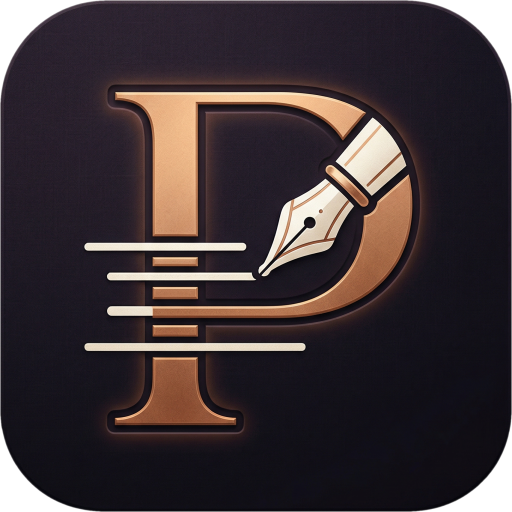
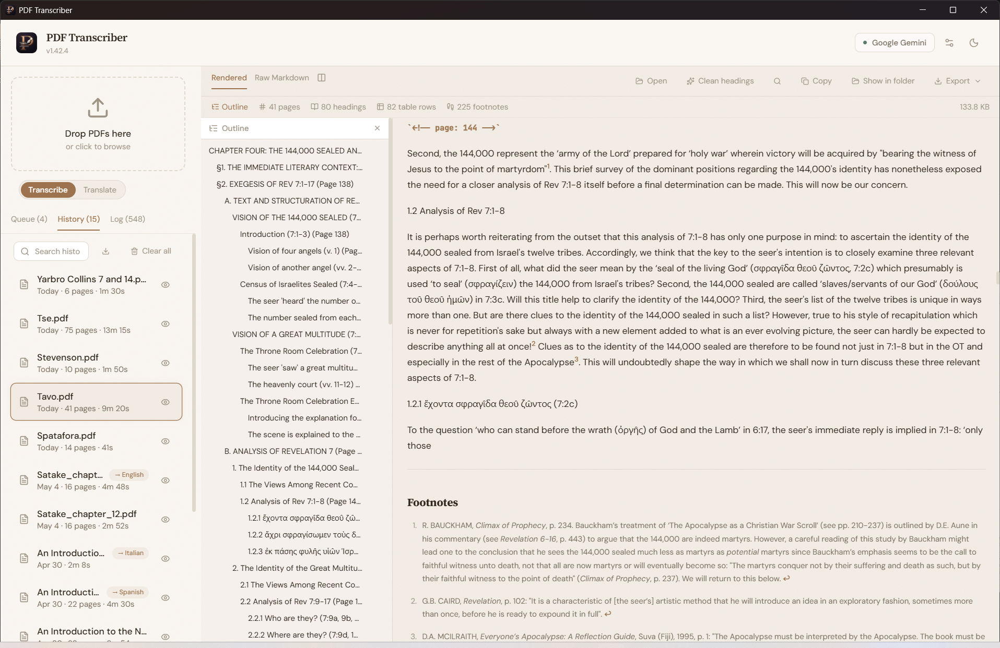
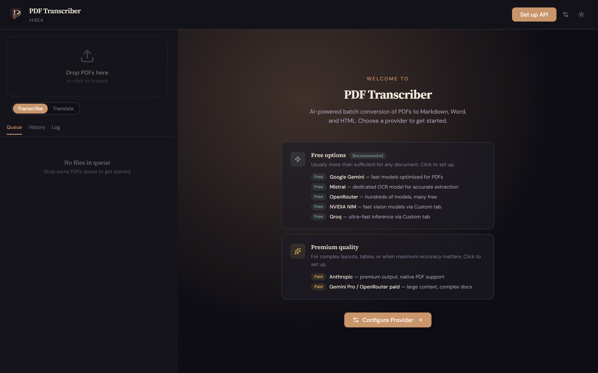
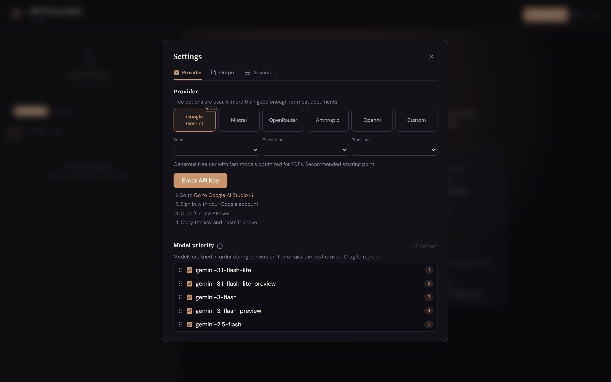

<div align="center">



# PDF Transcriber

**Turn PDFs of books, articles, and scanned documents into clean, structured Markdown, Word, and HTML — with the page numbers and document structure preserved.**

A desktop app (Windows & macOS) that uses AI vision models to transcribe even complex, multi-hundred-page documents accurately. Built for researchers, academics, and anyone who needs faithful, citable text out of a PDF.

</div>

---

## Why PDF Transcriber?

Most PDF-to-text tools either dump raw, unstructured text or choke on real-world documents — multi-column layouts, footnotes, scanned pages, roman-numeral front matter. PDF Transcriber is different in three ways that matter for scholarly work:

- **It preserves the document's structure.** Before transcribing a single page, it makes a first pass over the whole PDF to map the chapter/section hierarchy. Every heading in the output is leveled against that map, so the result has a real, navigable outline — not a flat wall of text.
- **It keeps the printed page numbers.** Each page's content is marked with the *actual* number printed in the book (`<!-- page: 148 -->`, roman numerals and odd starting points included). You can still cite "p. 153" after the PDF is gone.
- **It's accurate on hard documents.** Footnotes (`[^1]`), tables, paragraph breaks, and one-time section titles are preserved; repeating running headers ("a short title at the top of every page") are detected and dropped so they don't pollute your headings.



---

## Features

- **Faithful structure & page numbers** — outline-aware heading levels, printed page markers, footnotes, tables, and clean paragraph flow.
- **Batch the whole library at once** — drop in many PDFs; they convert one after another in a queue you can reorder, pause, and resume.
- **Crash-proof, resumable jobs** — progress is saved after every batch of pages. Close the app mid-run (or hit a network error on page 300) and pick up exactly where you left off.
- **Many AI providers, several free** — Google Gemini, Mistral OCR, OpenRouter, Anthropic, OpenAI, plus any OpenAI-compatible endpoint (e.g. NVIDIA NIM, Groq). Automatic fallback to the next model when one is rate-limited or unavailable.
- **Built-in translation** — optionally translate the transcription into another language as part of the same job.
- **Export anywhere** — Markdown, Word (`.docx`), HTML, and JSON. Plus a dedicated **Logos / Verbum `.docx`** export for Bible-study and theology software.
- **Runs on your machine** — your files and API keys stay local. No account, no upload to our servers (we don't have any).
- **Light & dark themes**, a side-by-side raw/rendered preview, full-text search, and in-app heading cleanup.

---

## How it works

PDF Transcriber runs a **three-stage pipeline**, and you can assign a different AI provider and model to each stage:

| Stage | What it does | Choosing a model |
| --- | --- | --- |
| **1. Scan** | Reads the entire PDF once to extract the page-numbering scheme and a full heading outline (table of contents). | Use your **most capable model** here. Stronger models do a noticeably better job mapping the structure of long or complex documents. |
| **2. Transcribe** | Converts the pages to Markdown in batches, using the Stage-1 outline to assign correct heading levels and carry section context across batch boundaries. | Can run on a **simpler, faster model** if you prefer — the Stage-1 outline keeps the structure right. |
| **3. Translate** *(optional)* | Translates the finished transcription into a target language, chunk by chunk. | Translation has different model needs than OCR. |

Long documents are split into page-range batches so they never exceed a model's context window, and the output is reassembled with YAML frontmatter (title, page count, provider, model, date) and a navigable outline at the top.

### A fast, practical combination

Use **Gemini to Scan** and **Mistral's OCR model to Transcribe**. Mistral's OCR model can't take the outline into account on its own, but after transcription PDF Transcriber sends the result back through Gemini to correct the heading and outline structure. This combination is **extremely fast** — though not quite as accurate as running a strong model like Gemini for *both* the Scan and Transcribe stages.

---

## Supported providers

| Provider | Cost | Notes |
| --- | --- | --- |
| **Google Gemini** | Free tier | Fast models tuned for PDFs. Recommended starting point. |
| **Mistral** | Free tier | Dedicated OCR model for accurate extraction. |
| **OpenRouter** | Many free models | Hundreds of models behind one key; can auto-select top free models. |
| **NVIDIA NIM / Groq** | Free tier | Fast vision/inference via the **Custom** (OpenAI-compatible) provider. |
| **Anthropic** | Paid | Premium output, native PDF support — best for complex layouts and tables. |
| **OpenAI** | Paid | Vision models via the standard API. |
| **Custom** | Varies | Any OpenAI-compatible endpoint. |

> You bring your own API key for whichever provider(s) you choose. Keys are stored locally on your machine.

---

## Installation

1. Go to the [**Releases**](../../releases) page.
2. Download the installer for your platform:
   - **Windows** — `PDF Transcriber Setup x.y.z.exe`
   - **macOS** — `PDF Transcriber-x.y.z.dmg`
3. Run the installer and launch the app.

---

## Quick start

1. **Open the app** and click **Configure Provider**.
2. **Paste an API key** for a provider (Gemini's free tier is a good first choice — the Settings panel links to where you get a key).
3. **Drag a PDF** (or several) onto the drop zone.
4. Watch the queue: each file is scanned, transcribed, and saved next to the original PDF.
5. **Preview** the result in-app, then export to Markdown, Word, HTML, JSON, or Logos/Verbum `.docx`.

To translate as well, toggle **Translate** on the drop zone and pick a target language before adding files.





---

## Translation

Translation runs as a two-step job. First, PDF Transcriber **transcribes the PDF** into Markdown exactly as it normally would (Scan + Transcribe). Then it takes that resulting Markdown and **translates it** into your chosen language, chunk by chunk.

Because the translation works from the finished transcription rather than the raw PDF, the translated document keeps the same structure, headings, and page markers as the original. To use it, toggle **Translate** on the drop zone and pick a target language before adding your files.

---

## Output formats & exports

Every transcription can be exported to several formats from the in-app preview:

- **Markdown** (`.md`) — the canonical output, with YAML frontmatter and a navigable outline.
- **Word** (`.docx`) — the Markdown is converted to a Word document that conserves all formatting, **including tables**, and footnotes are preserved as **native Word footnotes** (real footnote references, not plain text).
- **HTML** and **JSON** — for web publishing or programmatic use.
- **Logos / Verbum `.docx`** — an optional Word export formatted specifically for import into [Logos](https://www.logos.com/) / [Verbum](https://verbum.com/) Bible software as a **personal book**, so your own notes, articles, and study documents become searchable, linkable titles in your library.

---

## Privacy

PDF Transcriber is a local desktop app. Your PDFs are sent only to the AI provider you configure (to do the transcription) and to nowhere else. API keys are stored on your machine. There is no PDF Transcriber account or cloud service.

---

## Building from source

```bash
# Prerequisites: Node.js 20+

npm install

# Run the web UI in a browser (no Electron features)
npm run dev

# Run the full desktop app in development
npm run electron:dev

# Build a distributable installer for the current platform
npm run electron:build
```

The app is built with React 19, TypeScript, Vite, Tailwind CSS, and Electron.

---

## Responsible use

PDF Transcriber is a tool for working with documents you own or are otherwise entitled to use — for personal study, research, accessibility, and similar legitimate purposes. Please respect copyright and the terms under which you obtained any document. You are responsible for ensuring you have the right to transcribe, translate, and store the files you process.

---

## License

Released under the [MIT License](LICENSE).

---

<div align="center">
<sub>Made for people who read carefully.</sub>
</div>
